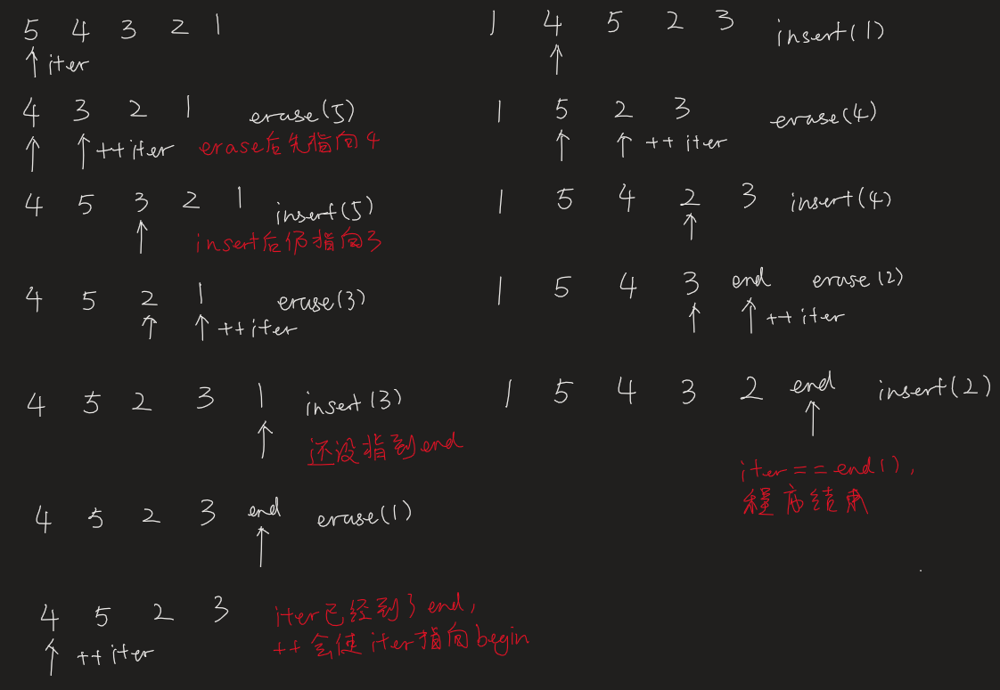

一个诡异的程序：将列表每两元素交换位置

问题描述：比如 list = {1 2 3 4 5 6}，处理后应为 {2 1 4 3 6 5}。

一开始的程序长这样：

```c++
#include <iostream>
#include <list>
#include <iterator>
using namespace std;

//********* 定义一个子函数，用于输出list元素
template<class T>
void printContainer(string s, T &c){
    cout << s << ": ";
    copy(c.begin(), c.end(), ostream_iterator<int>(cout, " "));
    cout << endl;
}

//********* 主函数实现处理需求
int main()
{
    list<int> lst = {1,2,3,4,5,6};
    printContainer("lst", lst);

    //********* 将lst每相邻两元素交换位置
    // 思路：将当前元素暂存后删除，iter往后移一个单位插入暂存元素，实现交换
    list<int>::iterator iter = lst.begin();
    while(iter != lst.end()){
        int v = *iter;
        iter = lst.erase(iter);
        lst.insert(++iter, v);
    }
    printContainer("lst modified", lst);
}
```

测试：

```sh
# 当lst有偶数个元素时，e.g. {1,2,3,4,5,6}
lst: 1 2 3 4 5 6 
lst modified: 2 1 4 3 6 5 

# 当lst有奇数个元素时，e.g. {1,2,3,4,5}
lst: 1 2 3 4 5 
lst modified: 5 1 2 3 4
```

可以看出，当lst有偶数个元素时，输出正确，但当lst有奇数个元素时，输出就有点让人摸不到头脑。比如 lst = {1,2,3,4,5}时，我想要的输出应该是 {2,1,4,3,5}，最后一个元素不动。

打断点debug一下，我发现程序执行过程是这样的：

首先，需要说明的是：

- `end()`指向的是最后一个元素的下一位，如 lst = {2,1,4,3,5}，lst.end()指向元素5的下一位。
- `erase(iter)`：erase iter所指元素后，iter不变，后续元素往前移一个单位。也就是说，iter将指向删除元素的下一元素，但iter所指的地址不变。
- `insert(++iter, v)`：
  - `++iter`：若iter已指向end，则++iter会指向begin。
  - `insert(iter, v)`：iter所指元素及其后续元素往后移一个单位，在iter所指位置insert新元素，然后iter往后移一个单位。结果：insert所指地址往后移一个单位，但所指元素不变。

lst = {2,1,4,3,5}时，上面的程序执行过程：



可以看出，当lst元素个数为奇数时：（1）while循环的所有轮中，不存在某一轮，当该轮while代码段走完时，iter指向end；（2）必存在某一轮，当该轮while代码段走完时，iter指向lst最后一个元素（iter == lastElemIter），此时就应该跳出while循环。

lst元素个数为偶数时，相应地，应在iter指向end的那一轮跳出循环。综上，设 P: iter\==lastElemIter, Q: iter\==end，则循环条件为$\neg(P\vee Q)= \neg P \wedge \neg Q$，即 (iter != lastElemIter) && (iter != end)。

修改后程序如下：

```c++
#include <iostream>
#include <list>
#include <iterator>
using namespace std;

template<class T>
void printContainer(string s, T &c){
    cout << s << ": ";
    copy(c.begin(), c.end(), ostream_iterator<int>(cout, " "));
    cout << endl;
}

int main()
{
    list<int> lst = {1,2,3,4,5};
    printContainer("lst", lst);

    //********* 将lst每相邻两元素交换位置
    list<int>::iterator lastElemIter = --lst.end(); // 指向lst最后一个元素
    list<int>::iterator iter = lst.begin();
    while(iter != lastElemIter && iter != lst.end()){ 
        int v = *iter;
        iter = lst.erase(iter);
        lst.insert(++iter, v);
    }
    printContainer("lst modified", lst);
}
```

测试：

```sh
# 奇数个元素
lst: 1 2 3 4 5 
lst modified: 2 1 4 3 5

# 偶数个元素
lst: 1 2 3 4 5 6 
lst modified: 2 1 4 3 6 5
```

